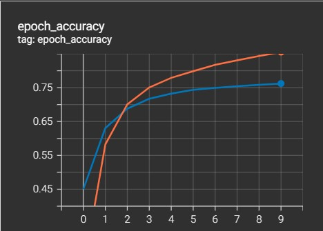
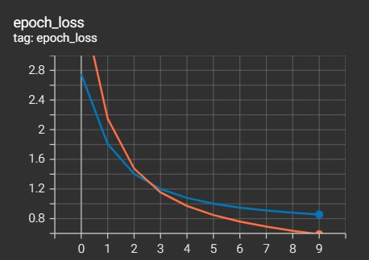
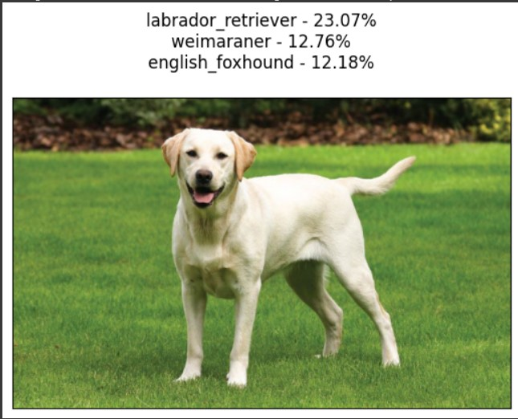
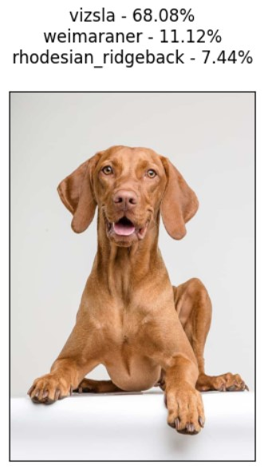
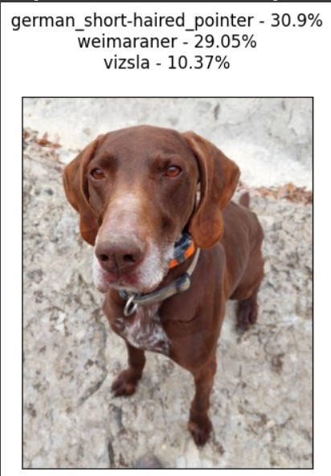
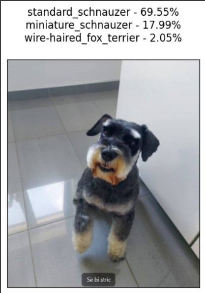
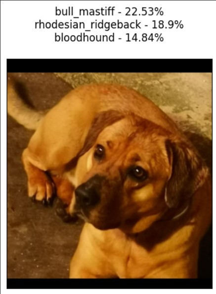
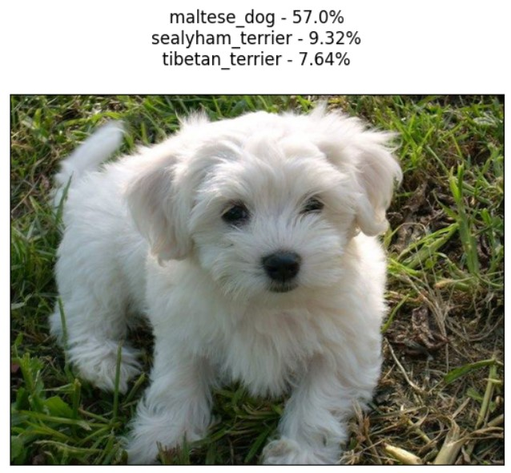
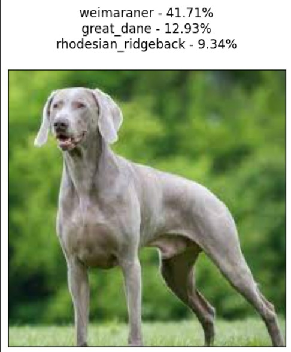

# Prepoznavanje pasmine pasa

**Autori:** Toni Baskijera i Martina Sirotić

**Mentor:** doc. dr. sc. Marina Ivašić Kos

**Kolegij:** Strojno i dubinsko učenje

**Akademska godina:** 2022/2023.

## Tablica sadržaja

- [Uvod](#uvod)
- [Korišteni podaci i razvojno okruženje](#korišteni-podaci-i-razvojno-okruženje)
- [Opis korištenih biblioteka i metoda](#opis-korištenih-biblioteka-i-metoda)
- [Izvedba eksperimenta](#izvedba-eksperimenta)
- [Rezultati i primjeri predikcija](#rezultati-i-primjeri-predikcija)
- [Zaključak](#zaključak)
- [Literatura](#literatura)

## Uvod

### Zadatak

Zadatak ovog projekta je razvijanje modela strojnog učenja koji identificira pasminu psa sa slike. Dakle, obučavanjem na opsežnom skupu podataka, model će uz pomoć MobileNet arhitekture dubinskog učenja steći sposobnost prepoznavanja različitih pasmina pasa i primijeniti to znanje na nove slike koje mu korisnik proslijedi. Detaljno će se objasniti cjelokupni proces strojnog učenja, uključujući korištene podatke, primjenjene metode i rezultate. Na kraju će se provesti evaluacija, analiza i usporedba spomenutih rezultata.

### Motivacija i pregled područja

Klasifikacija pasmina pasa oduvijek je bila intrigantno područje proučavanja za ljubitelje pasa, uzgajivače, veterinare i istraživače. Sposobnost točne identifikacije i razlikovanja između različitih pasmina pasa igra ključnu ulogu u više područja.

Doprinosi području dobrobiti životinja pomažući u razvoju ciljane zdravstvene skrbi i planova liječenja. Različite pasmine imaju različitu osjetljivost na određene bolesti i medicinska stanja. Stoga sposobnost točne identifikacije pasmine psa može pomoći veterinarima u pružanju odgovarajuće skrbi i smanjenju rizika od pogrešne dijagnoze ili netočnog liječenja.

Nadalje, identifikacija pasmina pasa ključna je za uzgajivače i entuzijaste koji su uključeni u programe uzgoja. Točna klasifikacija pomaže u održavanju integriteta i čistoće pasmina, osiguravajući odgovorne i informirane prakse uzgoja. Također pomaže u prepoznavanju prikladnih parova za parenje, povećavajući šanse za stvaranje zdravog potomstva sa željenim osobinama.

Osim toga, potražnja za udomljavanjem kućnih ljubimaca raste u cijelom svijetu. Mnogi pojedinci i obitelji traže posebne pasmine pasa koje odgovaraju njihovom načinu života, životnim uvjetima i preferencijama. AI model sposoban za točno prepoznavanje i klasificiranje pasmina pasa može pojednostaviti proces udomljavanja, olakšavajući spajanje potencijalnih vlasnika s njihovim željenim pasminama učinkovitije i djelotvornije.

S nedavnim napretkom u umjetnoj inteligenciji i strojnom učenju, postoji prilika za automatizaciju procesa kroz razvoj modela strojnog učenja koji može točno klasificirati pasmine pasa.

## Korišteni podaci i razvojno okruženje

Skup podataka koji će se koristiti za razvijanje modela, je Standford Dogs Dataset [[1]](<https://www.tensorflow.org/datasets/catalog/stanford_dogs>). Sadrži slike 120 pasmina pasa iz cijelog svijeta. Ovaj skup podataka izgrađen je korištenjem slika i komentara s ImageNeta u svrhu kategorizacije slika. Izvorno je prikupljen za finu kategorizaciju slike, što je izazovan problem jer određene pasmine pasa imaju gotovo identične značajke ili se razlikuju u boji i dobi.

Opis dataseta:

- Domena - računalni vid i strojno učenje
- Tip - slikovni podaci
- Broj primjera za učenje (slika) - 20.580
- Dimenzija - svaka slika je različitih dimenzija
- Anotacije - oznake klasa, granični okviri

Za razvoj modela i cjelokupni proces koristiti će se Google Collab Pro, koji je baziran na Jupyter bilježnici i predstavlja moćan i praktičan alat za izvođenje Python koda u oblaku, posebno kada su u pitanju zadaci za analizu podataka, strojno učenje i duboko učenje.

## Opis korištenih biblioteka i metoda

Korištene biblioteke, moduli i metode korištene u projektu, uključujući one namijenjene dubokom učenju, radu s podacima, datotekama i operativnim sustavom i manipulacijom slikama, možemo isčitati na početku Jupyter bilježnice gdje se one i uvoze:

```python
import tensorflow as tf
import tensorflow_datasets as tfds
import numpy as np
import matplotlib.pyplot as plt
import datetime
import os
from PIL import Image

from keras.applications import MobileNetV2
from keras.models import load_model, Sequential
from keras.layers import Flatten, Dense, Conv2D, MaxPool2D, Dropout, GlobalAveragePooling2D
from keras.optimizers import Adam
from keras.callbacks import ModelCheckpoint, TensorBoard

from tensorboard import notebook

from sklearn.metrics import classification_report
```

Pojašnjenje uloga biblioteka, modula i metoda:

- `tensorflow`: Razvojni okvir za strojno učenje
- `tensorflow_datasets`: Predefinirani skupovi podataka za strojno učenje.
- `numpy`: Matematičke operacije nad višedimenzionalnim nizovima i matricama
- `matplotlib.pyplot`: Alat za crtanje i vizualizaciju u Pythonu
- `datetime`: Manipulacija datumima i vremenima
- `os`: Interakcija s operacijskim sustavom, navigacija po direktorijima i rad s datotekama
- `PIL.Image`: Otvaranje, manipulacija i spremanje slika različitih formata
- `keras.applications.MobileNetV2`: Prethodno naučeni model MobileNetV2
- `keras.models.load_model`: Funkcija za učitavanje prethodno naučenih modela
- `keras.models.Sequential`: Klasa za definiranje sekvencijalnih modela
- `keras.layers.Flatten`: Ravnanje (flatten) sloj
- `keras.layers.Dense`: Gusti (dense) sloj
- `keras.layers.Conv2D`: Konvolucijski 2D sloj
- `keras.layers.MaxPool2D`: Maksimalno grupiranje (pooling) 2D sloj
- `keras.layers.Dropout`: Sloj ispuštanja (dropout)
- `keras.layers.GlobalAveragePooling2D`: Globalno prosječno grupiranje (pooling) 2D sloj
- `keras.optimizers.Adam`: Adam optimizator
- `keras.callbacks.ModelCheckpoint`: Callback za spremanje najboljeg modela tijekom treniranja
- `keras.callbacks.TensorBoard`: Callback za vizualizaciju napretka treniranja pomoću TensorBoard-a
- `tensorboard.notebook`: Alati za rad s TensorBoard-om u Jupyter bilježnici
- `google.colab.drive`: Funkcionalnost za montiranje i pristupanje Google Drive-u u Google Colab okruženju
- `sklearn.metrics.classification_report`:Služi za generiranje klasifikacijskog izvještaja

Arhitektura modela koja će se koristiti za model, kao što je već i spomenuto, naziva se MobileNet. MobileNet je arhitektura konvolucijske neuronske mreže posebno dizajnirana za mobilne uređaje i ugrađene sustave s ograničenim računalnim resursima. Razvijen je kako bi riješio izazov implementacije dubokih modela učenja na uređajima s malom memorijom i procesorskom snagom, uz održavanje visoke točnosti. MobileNet postiže ovo korištenjem dubinski odvojenih konvolucija, koje razdvajaju standardnu konvolucijsku operaciju na zasebne dubinske i točkaste konvolucije. Ovaj pristup značajno smanjuje broj parametara i računalnih operacija potrebnih za obradu, rezultirajući kompaktnim i učinkovitim modelom.

Razlog iz kojeg smo odabrali baš MobileNet arhitekturu je taj što bi kasnije model koji će se istrenirati htjeli upotrijebiti, odnosno koristiti kao glavnu funkcionalnost unutar mobilne aplikacije, koje su inače područje u kojem imamo nešto više iskustva.

## Izvedba eksperimenta

Za početak, potrebno je montirati Google Drive na direktorij `/content/drive`, kojeg ćemo koristiti za spremanje podataka:

```python
drive.mount('/content/drive')
```

U sljedećem dijelu koda definirane su funkcije za učitavanje i obradu skupa podataka:

```python
def load_dataset():
    (ds_train, ds_test), ds_info = tfds.load('stanford_dogs',
                                             split=['train', 'test'],
                                             shuffle_files=True,
                                             as_supervised=False,
                                             with_info=True,
                                             data_dir='/content/drive/MyDrive/dataset/tfds')
    return ds_train, ds_test, ds_info

def calculate_total_images(ds_train, ds_test):
    total_train_images = len(ds_train)
    total_test_images = len(ds_test)
    total_images = total_train_images + total_test_images
    return total_images

def preprocess(data, image_size, num_labels, cast=True, resize=True, normalize=True, one_hot=True):
    processed_image = data['image']
    label = data['label']
    if cast:
        processed_image = tf.cast(processed_image, tf.float32)
    if resize:
        processed_image = tf.image.resize(processed_image, image_size, method='nearest')
    if normalize:
        processed_image = processed_image / 255.
    if one_hot:
        label = tf.one_hot(label, num_labels)
    return processed_image, label

def prepare(dataset, image_shape, num_classes, batch_size=None):
    dataset = dataset.map(lambda x: preprocess(x, image_shape[0:-1], num_classes), num_parallel_calls=tf.data.AUTOTUNE)
    dataset = dataset.cache()
    if batch_size is not None:
        dataset = dataset.batch(batch_size)
    dataset = dataset.prefetch(buffer_size=tf.data.AUTOTUNE)
    return dataset

```

`load_dataset()`: Ova funkcija učitava skup podataka "stanford_dogs" iz TensorFlow Datasets (tfds). Dohvaća podatke za trening i testiranje, informacije o skupu podataka i postavlja direktorij podataka na '/content/drive/MyDrive/dataset/tfds'. Vraća učitane skupove podataka za trening, testiranje i informacije o skupu podataka.

`calculate_total_images(ds_train, ds_test)`: Ova funkcija izračunava ukupan broj slika u skupu podataka. Prima skupove podataka za trening i testiranje i vraća ukupan broj slika uključujući slike za trening i testiranje.

`preprocess(data, image_size, num_labels, cast=True, resize=True, normalize=True, one_hot=True)`: Ova funkcija provodi predprocesiranje podataka. Prima podatke (slike i oznake), veličinu slike, broj oznaka, te opcionalne argumente za pretvorbu tipa podataka (cast), promjenu veličine slike (resize), normalizaciju slike (normalize) i pretvorbu oznaka u one-hot reprezentaciju. Izvodi odgovarajuće predobradne korake na slikama i oznakama i vraća predobrađene slike i oznake.

`prepare(dataset, image_shape, num_classes, batch_size=None)`: Ova funkcija priprema skup podataka za treniranje ili testiranje. Prima skup podataka, oblik slike, broj klasa i opcionalni argument za veličinu grupa (batch_size). Koristi spomenuta funkciju `preprocess()` za predobradu svakog podatka u skupu podataka, pohranjuje predobrađene podatke u predmemoriju (cache), grupira ih u grupe određene veličine (batch_size) ako je to specificirano, i povećava učinkovitost pri dohvatu podataka koristeći `prefetch()` metodu. Vraća pripremljeni skup podataka.

Tada skup podataka konačno možemo i preuzeti koristeći funkciju koju smo definirali:

```
ds_ train, ds_test, ds_info = load_dataset()
```

Definirati ćemo i funkciju load_labels, kojom možemo ispisati sve pasmine u skupu podataka:

```python
def load_labels():
  breed_names = []
  with open("/content/drive/MyDrive/dataset/tfds/stanford_dogs/0.2.0/label.labels.txt", 'r') as f:
    for line in f:
      line = line.replace('\n', '')[10:]
      breed_names.append(line)
  return breed_names
```

Ispis svih 120 pasmina:

```
load_labels()

['chihuahua',
 'japanese_spaniel',
 'maltese_dog',
 'pekinese',
 'shih-tzu',
 'blenheim_spaniel',
 'papillon',
 'toy_terrier',
 'rhodesian_ridgeback',
 'afghan_hound',
 'basset',
 'beagle',
 'bloodhound',
 'bluetick',
 'black-and-tan_coonhound',
 'walker_hound',
 'english_foxhound',
 'redbone',
 'borzoi',
 'irish_wolfhound',
 'italian_greyhound',
 'whippet',
 'ibizan_hound',
 'norwegian_elkhound',
 'otterhound',
 'saluki',
 'scottish_deerhound',
 'weimaraner',
 'staffordshire_bullterrier',
 'american_staffordshire_terrier',
 'bedlington_terrier',
 'border_terrier',
 'kerry_blue_terrier',
 'irish_terrier',
 'norfolk_terrier',
 'norwich_terrier',
 'yorkshire_terrier',
 'wire-haired_fox_terrier',
 'lakeland_terrier',
 'sealyham_terrier',
 'airedale',
 'cairn',
 'australian_terrier',
 'dandie_dinmont',
 'boston_bull',
 'miniature_schnauzer',
 'giant_schnauzer',
 'standard_schnauzer',
 'scotch_terrier',
 'tibetan_terrier',
 'silky_terrier',
 'soft-coated_wheaten_terrier',
 'west_highland_white_terrier',
 'lhasa',
 'flat-coated_retriever',
 'curly-coated_retriever',
 'golden_retriever',
 'labrador_retriever',
 'chesapeake_bay_retriever',
 'german_short-haired_pointer',
 'vizsla',
 'english_setter',
 'irish_setter',
 'gordon_setter',
 'brittany_spaniel',
 'clumber',
 'english_springer',
 'welsh_springer_spaniel',
 'cocker_spaniel',
 'sussex_spaniel',
 'irish_water_spaniel',
 'kuvasz',
 'schipperke',
 'groenendael',
 'malinois',
 'briard',
 'kelpie',
 'komondor',
 'old_english_sheepdog',
 'shetland_sheepdog',
 'collie',
 'border_collie',
 'bouvier_des_flandres',
 'rottweiler',
 'german_shepherd',
 'doberman',
 'miniature_pinscher',
 'greater_swiss_mountain_dog',
 'bernese_mountain_dog',
 'appenzeller',
 'entlebucher',
 'boxer',
 'bull_mastiff',
 'tibetan_mastiff',
 'french_bulldog',
 'great_dane',
 'saint_bernard',
 'eskimo_dog',
 'malamute',
 'siberian_husky',
 'affenpinscher',
 'basenji',
 'pug',
 'leonberg',
 'newfoundland',
 'great_pyrenees',
 'samoyed',
 'pomeranian',
 'chow',
 'keeshond',
 'brabancon_griffon',
 'pembroke',
 'cardigan',
 'toy_poodle',
 'miniature_poodle',
 'standard_poodle',
 'mexican_hairless',
 'dingo',
 'dhole',
 'african_hunting_dog']
```

Prikaz slika:

```
tfds.show_examples(ds_train, ds_info)
```


Zatim ćemo definirati nekoliko konstanti koje ćemo koristiti:

```python
IMG_SHAPE = 224
IMG_CHANNELS = 3
INPUT_SHAPE = (IMG_SHAPE, IMG_SHAPE, IMG_CHANNELS)
BATCH_SIZE = 32
NUM_BREEDS = len(load_labels())
```

- `IMG_SHAPE` definira oblik slika koje će se koristiti u modelu. U ovom slučaju, postavljen je na 224, što znači da će sve slike biti skalirane na dimenzije 224x224 piksela
- `IMG_CHANNELS` definira broj kanala slike. Ovdje je postavljen na 3, što označava tri kanala: crveni, zeleni i plavi (RGB)
- `INPUT_SHAPE` definira oblik ulaznih podataka za model. Ova varijabla je tuple koja sadrži dimenzije slike (IMG_SHAPE), broj kanala (IMG_CHANNELS) i stoga ima oblik (224, 224, 3)
- `BATCH_SIZE` predstavlja veličinu grupa (batch size) koja će se koristiti tijekom obuke modela. Ovdje je postavljen na 32, što znači da će se 32 primjera koristiti za svaku iteraciju tijekom obuke
- `NUM_BREEDS` predstavlja broj različitih pasmina pasa u skupu podataka. Ova varijabla dobiva vrijednost pomoću funkcije `len(load_labels())`, koja učitava oznake pasmina pasa i računa njihov broj

U nastavku se stvaraju skupovi za treniranje i testiranje:

```python
train_set = prepare(ds_train, INPUT_SHAPE, NUM_BREEDS, batch_size=BATCH_SIZE)
test_set = prepare(ds_test, INPUT_SHAPE, NUM_BREEDS, batch_size=BATCH_SIZE)
```

- `train_set` predstavlja skup za treniranje modela. Ova varijabla dobiva vrijednost pozivom funkcije `prepare` s parametrima `ds_train` (skup podataka za treniranje), `INPUT_SHAPE` (ulazni oblik podataka), `NUM_BREEDS` (broj pasmina) i `batch_size` (veličina grupe).
- `test_set` predstavlja skup za testiranje modela. Ova varijabla dobiva vrijednost pozivom funkcije `prepare` s parametrima `ds_test` (skup podataka za testiranje), `INPUT_SHAPE` (ulazni oblik podataka), `NUM_BREEDS` (broj pasmina) i `batch_size` (veličina grupe).

Model koji ćemo koristiti definirati ćemo isto tako u zasebnoj funkciji:

```python
def mobileNetV2(image_shape, num_classes, lr=0.001):
    base_model = MobileNetV2(input_shape=image_shape, include_top=False, weights='imagenet')
    base_model.trainable = False
    model = Sequential([
        base_model,
        GlobalAveragePooling2D(),
        Dense(num_classes, activation='softmax')
    ])

    model.compile(optimizer=Adam(lr), loss='categorical_crossentropy', metrics=['accuracy'])
    return model
```

- Funkcija `mobileNetV2` prima tri parametra kao ulaz: `image_shape` (oblik slike), `num_classes` (broj klasa) i opcionalni parametar `lr` (stopa učenja) s zadanom vrijednošću `0.001`.
- Funkcija stvara temeljni model koristeći MobileNetV2 arhitekturu pozivajući funkciju `MobileNetV2` iz Keras biblioteke. Taj je model unaprijed istreniran na ImageNet skupu podataka i koristit će se kao ekstraktor značajki.
- Parametar `input_shape` MobileNetV2 modela postavljen je na vrijednost `image_shape` koja je proslijeđena funkciji `mobileNetV2`.
- Parametar `include_top` postavljen je na `False` kako bi se isključili potpuno povezani slojevi na vrhu MobileNetV2 modela, što nam omogućuje da kasnije dodamo svoje prilagođene slojeve.
- Parametar `weights` postavljen je na `'imagenet'`, što učitava unaprijed obučene težine MobileNetV2 modela obučenog na ImageNet skupu podataka.
- Svojstvo `trainable` temeljnog modela postavljeno je na `False`, što zamrzava težine temeljnog modela tijekom obuke, sprječavajući njihovo ažuriranje.
- Stvara se novi sekvencijalni model spajajući temeljni model i dodatne slojeve. Temeljni model služi kao početni dio modela i izvlači relevantne značajke iz ulaznih slika.
- Nakon temeljnog modela dodaje se sloj `GlobalAveragePooling2D`. Taj sloj uzima izlaz temeljnog modela i izračunava prosjek svake značajne mape, smanjujući prostorne dimenzije značajki.
- Izlaz sloja `GlobalAveragePooling2D` zatim se prosljeđuje sloju `Dense`. Taj sloj je potpuno povezan sloj s `num_classes` jedinica, što odgovara broju klasa u zadatku klasifikacije.
- Aktivacijska funkcija koja se koristi za sloj `Dense` je `'softmax'`, što proizvodi vjerojatnosnu distribuciju nad klasama, koja ukazuje na vjerojatnost svake od klasa
- Model se kompajlira pomoću metode `compile`. Optimizator je postavljen na Adam s stopom učenja `lr` koja je zadana kao parametar. Funkcija gubitka postavljena je na `'categorical_crossentropy'`, što se često koristi za višeklasnu klasifikaciju.
- Metrike za evaluaciju tijekom obuke postavljene su na `'accuracy'`, što mjeri točnost predikcija modela u usporedbi s istinskim oznakama.
- Na kraju, funkcija vraća kompilirani model.

  U nastavku ćemo definirati još nekoliko funkcija:

  ```python

  def create_model():
      net = mobileNetV2(INPUT_SHAPE, NUM_BREEDS, lr=0.0001)
      return net

  def evaluate(net):
      metrics = net.evaluate(test_set, return_dict=True, verbose=1)
      for key, value in metrics.items():
          print(key + ": {}".format(round(value, 2)))

  def training(net, name, log_dir, checkpoint_path):
      net.summary()

      tensorboard_callback = TensorBoard(log_dir=log_dir, histogram_freq=1, profile_batch=0)
      cp_callback = ModelCheckpoint(filepath=checkpoint_path, save_weights_only=True, verbose=1)

      net.fit(train_set, epochs=10, validation_data=test_set, callbacks=[tensorboard_callback, cp_callback])

      net.save(save_path + "/{}".format(name))
      net.save("/content/drive/MyDrive/dataset/{}.h5".format(name))
  ```

  - `create_model()`: Funkcija koja stvara model temeljen na mobileNetV2 arhitekturi i vraća kompajlirani model.

  - `evaluate(model, test_dataset)`: Funkcija koja evaluira model na testnom skupu podataka i ispisuje rezultate metrika.

  - `training(net, name, log_dir, checkpoint_path)`: Funkcija koja obavlja trening modela na skupu podataka za treniranje, sprema model na određenoj putanji i sprema kontrolne točke modela.

Tada moramo definirati još nekoliko varijabli:

```python
timestamp_str = datetime.datetime.now().strftime("%Y%m%d-%H%M%S")
save_path = "/content/drive/MyDrive/dataset"
checkpoint_path1 = "/content/drive/MyDrive/dataset/checkpoints/mobilenet" + timestamp_str + "/model.ckpt"
checkpoint_dir1 = os.path.dirname(checkpoint_path1)
log_create_dir1 = os.path.dirname(save_path + "/logs/fit/mobilenet/")
log_dir1 = "/content/drive/MyDrive/dataset/logs/fit/mobilenet/" + timestamp_str
```

U ovom dijelu koda, varijabli `timestamp_str` dodjeljuje se format datuma koristeći metodu `strftime` iz modula `datetime`. Varijabla `save_path` postavljena je na `/content/drive/MyDrive/dataset`, što predstavlja direktorij u kojem će se spremiti skup podataka.

Varijabla `checkpoint_path1` konstruira se dodavanjem `timestamp_str` na putanju direktorija za kontrolne točke, `/content/drive/MyDrive/dataset/checkpoints/mobilenet`, nakon čega slijedi ime checkpointa `/model.ckpt`. Varijabli `checkpoint_dir1` zatim se dodjeljuje putanja direktorija izdvojena iz `checkpoint_path1` koristeći funkciju `os.path.dirname`.

Slično tome, varijabli `log_create_dir1` dodjeljuje se putanja direktorija izdvojena iz konkatenacije `save_path` i `/logs/fit/mobilenet/`. Konačno, varijabli `log_dir1` dodjeljuje se potpuna putanja za direktorij s log datotekama dodavanjem `timestamp_str` na "/content/drive/MyDrive/dataset/logs/fit/mobilenet/".

U ovom je trenutku sve spremno za kreiranje i treniranje modela:

```python
mobilenet = create_model()
training(mobilenet, 'mobileNet_dogs', log_dir1, checkpoint_path1)
```

U ovom dijelu koda, najprije se stvara model pozivom funkcije `create_model()` i dodjeljuje se varijabli `mobilenet`. Zatim se navedeni model trenira pozivom funkcije `training()`, koja prima model, naziv modela za identifikaciju, putanju do direktorija za spremanje logova i putanju do kontrolne točke modela.

Nakon treniranja, model se evaluira pozivom funkcije `evaluate()` kako bi se dobila mjera performansi na testnim podacima:

```python
evaluate(mobilenet)

269/269 [==============================] - 11s 41ms/step - loss: 0.8559 - accuracy: 0.7621
loss: 0.86
accuracy: 0.76
```

Vrijednost gubitka (loss) od 0.86 označava prosječnu pogrešku modelovih predikcija, pri čemu su niže vrijednosti poželjnije. Što se tiče točnosti (accuracy), model postiže rezultat od 0.76, što znači da ispravno predviđa klasu slike otprilike 76% vremena.

Za kraj moramo navesti nekoliko funkcija za prikaz izvještaja i generiranje predikcija nad slikama:

```python
def generate_classification_report(model, dataset, num_classes, target_names):
    true_labels = []
    predicted_labels = []

    for image, label in dataset:
        true_labels.extend(label.numpy())
        prediction = model.predict(image)
        predicted_label = np.argmax(prediction, axis=1)[0]
        predicted_labels.append(predicted_label)

    true_labels = np.array(true_labels)
    predicted_labels = np.array(predicted_labels)

    report = classification_report(true_labels, predicted_labels, target_names=target_names)
    return report

def predict(x, top_k):
    input_shape = model.layers[0].input_shape[1:]
    if isinstance(x, np.ndarray):
        assert x.shape == input_shape
        x = tf.convert_to_tensor(x)
    x = tf.expand_dims(x, axis=0)

    pred = model.predict(x)
    top_k_pred, top_k_indices = tf.math.top_k(pred, k=top_k)

    predictions = dict()
    for j in range(top_k):
        name = ds_info.features['label'].int2str(top_k_indices[0][j])
        name = name.replace('\n', '')[10:]
        value = top_k_pred.numpy()[0][j]
        value = round(100*value, 2)
        predictions[name] = value

    return predictions

def load_image(url, output_shape=(224, 224)):
    timestamp = datetime.datetime.now().strftime('%Y%m%d-%H%M%S')
    if url.startswith('/content/'):
        file_name = url
    else:
        file_name = '/content/drive/MyDrive/dataset/downloads/image-{}.jpg'.format(timestamp)
        image = get_file(file_name, url, extract=True)

    img = load_img(file_name).resize(output_shape)
    img_array = img_to_array(img) / 255.
    return img_array, file_name

def make_predictions(url=None):
    if url is None:
        url_input = input('Enter a URL for the image: ')

    img_array, file_name = load_image(url_input)
    result = predict(img_array, 3)

    plt.figure()
    img = Image.open(file_name)
    plt.xticks([])
    plt.yticks([])
    plt.imshow(img)
    predictions = ''
    for key, value in result.items():
        predictions += '{} - {}%\n'.format(key, value)
    plt.title(predictions)
    plt.show()
```

- `generate_classification_report(model, dataset, num_classes, target_names)`: Generira izvješće o klasifikaciji na temelju modela i skupa podataka.

- `predict(x, top_k)`: Vraća najbolje predikcije i pripadajuće oznake za dani model i sliku.

- `load_image(url, output_shape=(224, 224))`: Učitava sliku s danog URL-a i mijenja joj veličinu prema zadanoj veličini.

- `make_predictions(url=None)`: Izvršava predikcije za danu sliku i prikazuje rezultate.

## Rezultati i primjeri predikcija

Od generiranih logova tijekom treniranja, možemo izvući razne metrike i grafove korištenjem `Tensorboarda`:

```python
notebook.start("--logdir=/content/drive/MyDrive/dataset/logs/fit/mobilenet")
```





Na sljedeći način možemo generirati i klasifikacijski izvještaj:

```python
target_names = load_labels()
model = load_model('/content/drive/MyDrive/dataset/mobileNet_dogs.h5')
validation_set = prepare(ds_test, INPUT_SHAPE, NUM_BREEDS, batch_size=BATCH_SIZE)
true_labels = []
predicted_labels = []
for image, label in validation_set:
    true_labels.extend(np.argmax(label, axis=1))
    prediction = model.predict(image)
    predicted_labels.extend(np.argmax(prediction, axis=1))
true_labels = np.array(true_labels)
predicted_labels = np.array(predicted_labels)
print(classification_report(true_labels, predicted_labels, target_names=target_names))
```

|             Class              | Precision | Recall | F1-Score | Support |
| :----------------------------: | :-------: | :----: | :------: | :-----: |
|           chihuahua            |   0.56    |  0.75  |   0.64   |   52    |
|        japanese_spaniel        |   0.93    |  0.87  |   0.90   |   85    |
|          maltese_dog           |   0.84    |  0.86  |   0.85   |   152   |
|            pekinese            |   0.71    |  0.71  |   0.71   |   49    |
|            shih-tzu            |   0.67    |  0.64  |   0.65   |   114   |
|        blenheim_spaniel        |   0.90    |  0.86  |   0.88   |   88    |
|            papillon            |   0.91    |  0.89  |   0.90   |   96    |
|          toy_terrier           |   0.67    |  0.64  |   0.65   |   72    |
|      rhodesian_ridgeback       |   0.66    |  0.53  |   0.58   |   72    |
|          afghan_hound          |   0.90    |  0.88  |   0.89   |   139   |
|             basset             |   0.84    |  0.79  |   0.81   |   75    |
|             beagle             |   0.83    |  0.72  |   0.77   |   95    |
|           bloodhound           |   0.93    |  0.76  |   0.84   |   87    |
|            bluetick            |   0.73    |  0.77  |   0.75   |   71    |
|    black-and-tan_coonhound     |   0.77    |  0.73  |   0.75   |   59    |
|          walker_hound          |   0.54    |  0.58  |   0.56   |   53    |
|        english_foxhound        |   0.70    |  0.74  |   0.72   |   57    |
|            redbone             |   0.58    |  0.73  |   0.65   |   48    |
|             borzoi             |   0.78    |  0.84  |   0.81   |   51    |
|        irish_wolfhound         |   0.74    |  0.62  |   0.68   |   118   |
|       italian_greyhound        |   0.65    |  0.67  |   0.66   |   82    |
|            whippet             |   0.68    |  0.62  |   0.65   |   87    |
|          ibizan_hound          |   0.79    |  0.82  |   0.80   |   88    |
|       norwegian_elkhound       |   0.93    |  0.89  |   0.91   |   96    |
|           otterhound           |   0.68    |  0.88  |   0.77   |   51    |
|             saluki             |   0.85    |  0.78  |   0.81   |   100   |
|       scottish_deerhound       |   0.79    |  0.76  |   0.78   |   132   |
|           weimaraner           |   0.84    |  0.88  |   0.86   |   60    |
|   staffordshire_bullterrier    |   0.59    |  0.47  |   0.53   |   55    |
| american_staffordshire_terrier |   0.42    |  0.56  |   0.48   |   64    |
|       bedlington_terrier       |   0.91    |  0.96  |   0.93   |   82    |
|         border_terrier         |   0.79    |  0.78  |   0.78   |   72    |
|       kerry_blue_terrier       |   0.82    |  0.84  |   0.83   |   79    |
|         irish_terrier          |   0.65    |  0.70  |   0.67   |   69    |
|        norfolk_terrier         |   0.62    |  0.68  |   0.65   |   72    |
|        norwich_terrier         |   0.64    |  0.68  |   0.66   |   85    |
|       yorkshire_terrier        |   0.51    |  0.53  |   0.52   |   64    |
|    wire-haired_fox_terrier     |   0.84    |  0.75  |   0.80   |   57    |
|        lakeland_terrier        |   0.58    |  0.65  |   0.61   |   97    |
|        sealyham_terrier        |   0.93    |  0.95  |   0.94   |   102   |
|            airedale            |   0.85    |  0.79  |   0.82   |   102   |
|             cairn              |   0.84    |  0.71  |   0.77   |   97    |
|       australian_terrier       |   0.71    |  0.67  |   0.69   |   96    |
|         dandie_dinmont         |   0.97    |  0.93  |   0.95   |   80    |
|          boston_bull           |   0.91    |  0.78  |   0.84   |   82    |
|      miniature_schnauzer       |   0.77    |  0.67  |   0.71   |   54    |
|        giant_schnauzer         |   0.71    |  0.72  |   0.71   |   57    |
|       standard_schnauzer       |   0.61    |  0.65  |   0.63   |   55    |
|         scotch_terrier         |   0.82    |  0.81  |   0.82   |   58    |
|        tibetan_terrier         |   0.75    |  0.61  |   0.67   |   106   |
|         silky_terrier          |   0.74    |  0.58  |   0.65   |   83    |
|  soft-coated_wheaten_terrier   |   0.70    |  0.66  |   0.68   |   56    |
|  west_highland_white_terrier   |   0.79    |  0.91  |   0.85   |   69    |
|             lhasa              |   0.50    |  0.62  |   0.55   |   86    |
|     flat-coated_retriever      |   0.62    |  0.88  |   0.73   |   52    |
|     curly-coated_retriever     |   0.82    |  0.82  |   0.82   |   51    |
|        golden_retriever        |   0.80    |  0.78  |   0.79   |   50    |
|       labrador_retriever       |   0.82    |  0.70  |   0.76   |   71    |
|    chesapeake_bay_retriever    |   0.71    |  0.81  |   0.76   |   67    |
|  german_short-haired_pointer   |   0.73    |  0.69  |   0.71   |   52    |
|             vizsla             |   0.69    |  0.78  |   0.73   |   54    |
|         english_setter         |   0.77    |  0.67  |   0.72   |   61    |
|          irish_setter          |   0.81    |  0.87  |   0.84   |   55    |
|         gordon_setter          |   0.77    |  0.77  |   0.77   |   53    |
|        brittany_spaniel        |   0.82    |  0.69  |   0.75   |   52    |
|            clumber             |   0.79    |  0.84  |   0.82   |   50    |
|        english_springer        |   0.83    |  0.85  |   0.84   |   59    |
|     welsh_springer_spaniel     |   0.78    |  0.80  |   0.79   |   50    |
|         cocker_spaniel         |   0.73    |  0.73  |   0.73   |   59    |
|         sussex_spaniel         |   0.90    |  0.90  |   0.90   |   51    |
|      irish_water_spaniel       |   0.80    |  0.80  |   0.80   |   50    |
|             kuvasz             |   0.79    |  0.74  |   0.76   |   50    |
|           schipperke           |   0.72    |  0.85  |   0.78   |   54    |
|          groenendael           |   0.85    |  0.78  |   0.81   |   50    |
|            malinois            |   0.81    |  0.78  |   0.80   |   50    |
|             briard             |   0.70    |  0.77  |   0.73   |   52    |
|             kelpie             |   0.61    |  0.58  |   0.60   |   53    |
|            komondor            |   0.86    |  0.94  |   0.90   |   54    |
|      old_english_sheepdog      |   0.76    |  0.86  |   0.80   |   69    |
|       shetland_sheepdog        |   0.73    |  0.72  |   0.73   |   57    |
|             collie             |   0.63    |  0.68  |   0.65   |   53    |
|         border_collie          |   0.75    |  0.72  |   0.73   |   50    |
|      bouvier_des_flandres      |   0.72    |  0.82  |   0.77   |   50    |
|           rottweiler           |   0.79    |  0.88  |   0.84   |   52    |
|        german_shepherd         |   0.79    |  0.79  |   0.79   |   52    |
|            doberman            |   0.64    |  0.78  |   0.70   |   50    |
|       miniature_pinscher       |   0.79    |  0.76  |   0.78   |   84    |
|   greater_swiss_mountain_dog   |   0.72    |  0.72  |   0.72   |   68    |
|      bernese_mountain_dog      |   0.85    |  0.92  |   0.89   |   118   |
|          appenzeller           |   0.52    |  0.65  |   0.57   |   51    |
|          entlebucher           |   0.88    |  0.69  |   0.77   |   102   |
|             boxer              |   0.65    |  0.59  |   0.62   |   51    |
|          bull_mastiff          |   0.79    |  0.75  |   0.77   |   56    |
|        tibetan_mastiff         |   0.77    |  0.77  |   0.77   |   52    |
|         french_bulldog         |   0.78    |  0.78  |   0.78   |   59    |
|           great_dane           |   0.70    |  0.66  |   0.68   |   56    |
|         saint_bernard          |   0.89    |  0.96  |   0.92   |   70    |
|           eskimo_dog           |   0.35    |  0.44  |   0.39   |   50    |
|            malamute            |   0.61    |  0.72  |   0.66   |   78    |
|         siberian_husky         |   0.69    |  0.46  |   0.55   |   92    |
|         affenpinscher          |   0.73    |  0.80  |   0.76   |   50    |
|            basenji             |   0.92    |  0.79  |   0.85   |   109   |
|              pug               |   0.79    |  0.85  |   0.82   |   100   |
|            leonberg            |   0.91    |  0.88  |   0.89   |   110   |
|          newfoundland          |   0.73    |  0.75  |   0.74   |   95    |
|         great_pyrenees         |   0.78    |  0.77  |   0.77   |   113   |
|            samoyed             |   0.86    |  0.96  |   0.90   |   118   |
|           pomeranian           |   0.96    |  0.87  |   0.92   |   119   |
|              chow              |   0.98    |  0.94  |   0.96   |   96    |
|            keeshond            |   0.92    |  0.95  |   0.93   |   58    |
|       brabancon_griffon        |   0.76    |  0.85  |   0.80   |   53    |
|            pembroke            |   0.79    |  0.78  |   0.78   |   81    |
|            cardigan            |   0.58    |  0.65  |   0.62   |   55    |
|           toy_poodle           |   0.61    |  0.49  |   0.54   |   51    |
|        miniature_poodle        |   0.44    |  0.44  |   0.44   |   55    |
|        standard_poodle         |   0.73    |  0.64  |   0.68   |   59    |
|        mexican_hairless        |   0.81    |  0.95  |   0.87   |   55    |
|             dingo              |   0.70    |  0.68  |   0.69   |   56    |
|             dhole              |   0.80    |  0.94  |   0.86   |   50    |
|      african_hunting_dog       |   0.91    |  0.99  |   0.94   |   69    |
|            Accuracy            |     -     |   -    |   0.76   |  8580   |
|           Macro avg            |   0.75    |  0.76  |   0.75   |  8580   |
|          Weighted avg          |   0.77    |  0.76  |   0.76   |  8580   |

Na temelju izvještaja o klasifikaciji i matrice zabune, možemo izvući nekoliko ključnih zaključaka. Pasmina s najvećom preciznošću, odnosno najnižom stopom lažnih pozitiva, je Dandie Dinmont. Dakle, kada model predvidi da je pas Dandie Dinmont, obično je u pravu. S druge strane, pasmina s najnižom preciznošću, odnosno većom stopom lažnih pozitiva, je Chihuahua. Stoga, model često pogrešno klasificira neke druge pasmine kao Chihuahue.

Kada je riječ o odzivu, odnosno sposobnosti ispravnog prepoznavanja pozitivnih instanci, izdvaja se pasmina Entlebucher s najvišim rezultatom. To ukazuje na to da model rijetko propušta prepoznati Entlebuchera kada se pojavi na slikama. S druge strane, japanski spanijel ima najniži rezultat odziva, što sugerira da model često ne uspijeva ispravno identificirati tu pasminu.

Za procjenu ukupne uspješnosti modela možemo pogledati metriku točnosti, koja mjeri postotak točno predviđenih instanci za sve pasmine. U ovom slučaju, model postiže točnost od 82%, što ukazuje da pravilno klasificira pse u većini slučajeva.

Primjeri predikcija:

- labrador
  

- Vizla
  

- Njemački kratkodlaki ptičar
  

- Snaucer
  

- Mješanac boksera i ridgebacka
  

- Maltezer
  

- Weimar
  

## Zaključak

Strojno i duboko učenje ima široku primjenu u svim aspektima zbog brojnih metoda i modela koji omogućuju istraživanje i rad na raznim problemima. Model koji prepoznaje pasmine pasa omogućit će budućim korisnicima dodavanje slike psa za kojeg žele dobiti pasminu. Neke pasmine dosta sliče te zbog toga postoje šumovi u stvorenim predikcijama (npr. razne vrste labradora). Kao potencijalno rješenje ovog modela može se model dodatno trenirati te ga na taj način poboljšati. Osim toga može se povećati broj epoha i smanjiti learning rate i batch size. Iako postoje neke greške u modelu smatramo kako pasmina psa nije od presudne važnosti te da je i ovakav model sasvim zadovoljavajući. Uz navedena poboljšanja i preinake, ovaj bi se model vrlo lako mogao pretvoriti u mobilnoj aplikaciju upravo zbog pogodne MobileNet arhitekture koja je korištena.

## Literatura

- [1] <https://www.tensorflow.org/datasets/catalog/stanford_dogs>
- [2] <https://www.tensorflow.org/datasets/api_docs/python/tfds/visualization/show_examples>
- [3] <https://www.tensorflow.org/tensorboard>
- [4] <https://datagen.tech/guides/computer-vision/resnet-50/>
- [5] <https://medium.com/nanonets/how-to-easily-build-a-dog-breed-image-classification-model-2fd214419cde>
- [6] <https://medium.com/@ankitsingh540/dog-breed-classification-using-a-pre-trained-cnn-model-32d0d8b9cc26>
- [7] <https://openai.com/blog/chatgpt>
